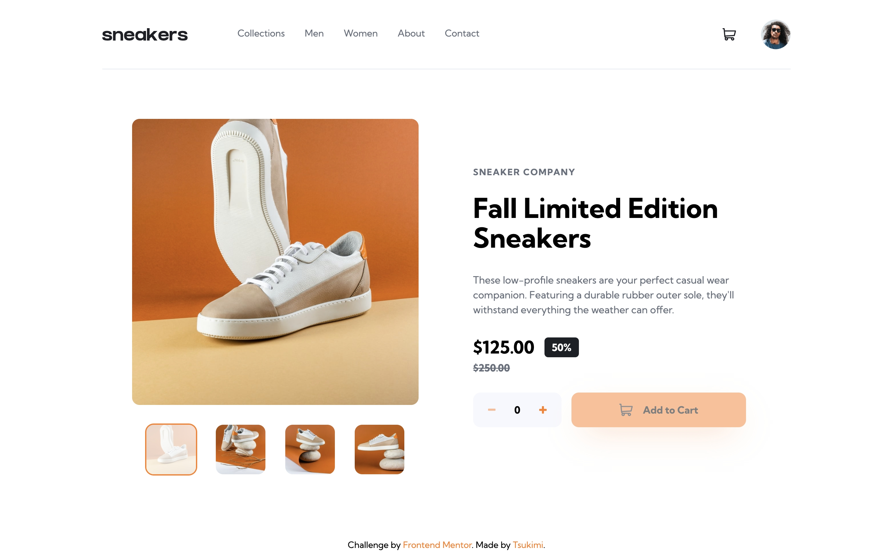
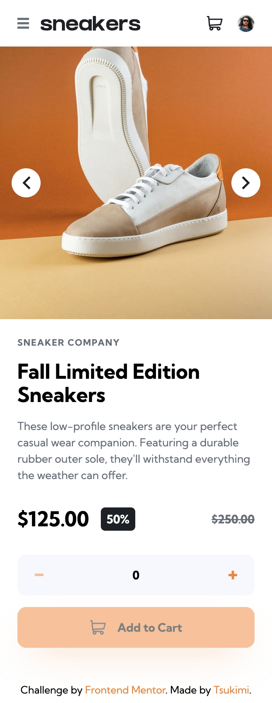

# Frontend Mentor - E-commerce product page solution

This is a solution to the [E-commerce product page challenge on Frontend Mentor](https://www.frontendmentor.io/challenges/ecommerce-product-page-UPsZ9MJp6). Frontend Mentor challenges help you improve your coding skills by building realistic projects.

## Table of contents

- [Frontend Mentor - E-commerce product page solution](#frontend-mentor---e-commerce-product-page-solution)
  - [Table of contents](#table-of-contents)
  - [Overview](#overview)
    - [The challenge](#the-challenge)
    - [Screenshot](#screenshot)
    - [Links](#links)
  - [My process](#my-process)
    - [Built with](#built-with)
    - [What I learned](#what-i-learned)
  - [Author](#author)

## Overview

### The challenge

Users should be able to:

- View the optimal layout for the site depending on their device's screen size
- See hover states for all interactive elements on the page
- Open a lightbox gallery by clicking on the large product image
- Switch the large product image by clicking on the small thumbnail images
- Add items to the cart
- View the cart and remove items from it

### Screenshot

Desktop

Mobile

Tablet

### Links

- [Live Site URL](https://e-commerce-product-page.frilly.dev/)

## My process

### Built with

- [Astro](https://astro.build/)
- [Tailwind CSS](https://tailwindcss.com/)
- [SolidJS](https://www.solidjs.com/)
- [Nanostores](https://github.com/nanostores/)

### What I learned

- Sharing a store between Astro Islands using Nanostores.
- Dealing with persistent states with `@nanostores/persistent`.
- Having two versions of the app toggling depending on the screen size.

## Author

- Website - [frilly.dev](https://frilly.dev/)
- Frontend Mentor - [@hikawi](https://www.frontendmentor.io/profile/hikawi)
